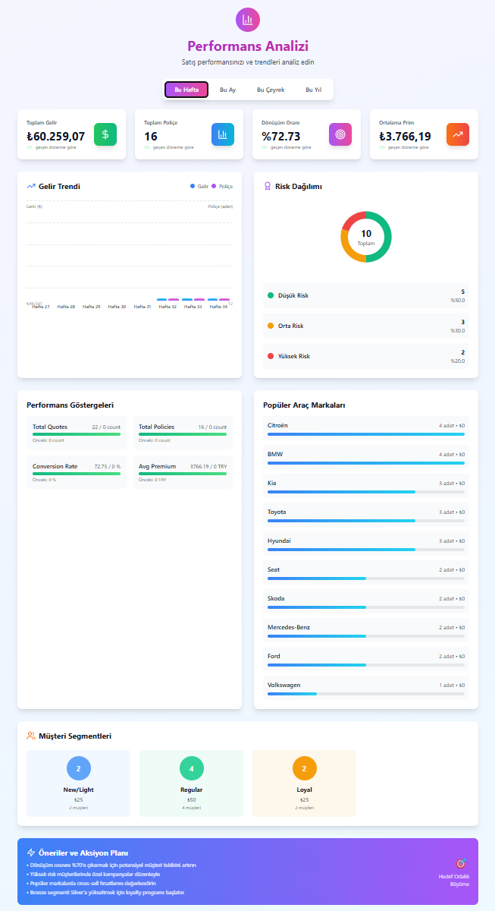
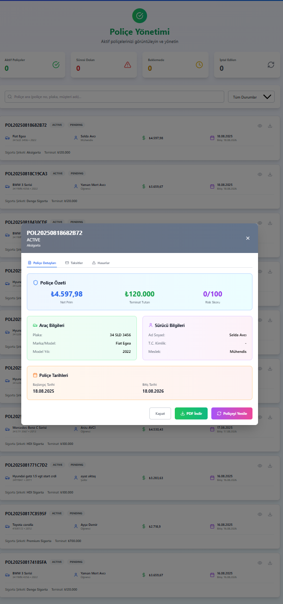
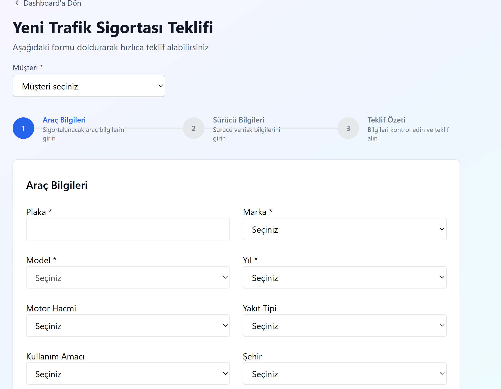

#  Trafik Sigortası Teklif & Poliçeleştirme Platformu  

[🇹🇷 Türkçe](#-türkçe) | [🇬🇧 English](#-english)  

---

## 🇹🇷 Türkçe

[](https://adoptium.net/)  
[](https://spring.io/projects/spring-boot)
[](https://react.dev/)
[](https://www.typescriptlang.org/)
[](https://www.postgresql.org/)
[](https://flywaydb.org/)
[](https://swagger.io/)

> Modern, ölçeklenebilir ve test odaklı bir **trafik sigortası teklif & poliçeleştirme** platformu.  
> Acenteler; müşteri–araç–sürücü bilgilerini girer, **şirket bazlı fiyat karşılaştırması** görür ve seçtiği teklifi **tek tıkla poliçeye dönüştürür**.  

---

### 📸 Ekran Görüntüleri  

| Analitik Dashboard | Poliçe Yönetimi |
|--------------------|-----------------|
|  |  |

| Sigorta Karşılaştırma | Yeni Teklif Formu |
|------------------------|-------------------|
|  |  |

---

### 🏗 Mimari  

```mermaid
flowchart LR
    U[User] --> FE[Frontend (React + TS)]
    FE -->|REST API| BE[Spring Boot Controllers]
    BE --> S[Service Layer]
    S --> R[Repositories]
    R --> DB[(PostgreSQL)]
    DB --> MIG[Flyway Migrations]
```

---

### ⚙️ Kurulum  

#### Gereksinimler  
- Java 21  
- Node 18+  
- PostgreSQL 16  

#### Veritabanı (Docker ile)  
```bash
docker run --name trafik_pg \
  -e POSTGRES_DB=teklif_db \
  -e POSTGRES_USER=postgres \
  -e POSTGRES_PASSWORD=postgres \
  -p 5432:5432 -d postgres:16
```

---

### ▶️ Çalıştırma  

#### Backend  
```bash
cd teklif-api
./gradlew bootRun
# Swagger UI: http://localhost:8080/swagger-ui.html
```

#### Frontend  
```bash
cd frontend/project
npm install
npm run dev
# http://localhost:5173
```

---

### 📡 Örnek API’ler  

| Method | Path                       | Açıklama                  |
| ------ | -------------------------- | ------------------------- |
| `POST` | `/api/quotes`              | Teklif oluştur            |
| `POST` | `/api/policies/from-quote` | Teklifi poliçeye dönüştür |
| `GET`  | `/api/analytics/overview`  | Genel analitik özet       |
| `GET`  | `/api/customers/{id}`      | Müşteri detayı            |

---

### ✅ Test & Kalite  

- 🧪 Unit Tests (Mockito)  
- 🛰 WebMvc Tests (Controller)  
- 🗄 DataJpa Tests (Repository)  
- 🔗 Smoke/E2E (Temel iş akışları)  

Coverage:  
```bash
cd teklif-api
./gradlew test jacocoTestReport
```

---

### ⚡️ Performans  

- N+1 query optimizasyonu  
- 5dk bellek cache (analytics)  
- PostgreSQL indeksleme  
- Ortalama p95 yanıt süresi < 400ms  

---

### 🗺 Yol Haritası  

- [ ]  JWT tabanlı kimlik doğrulama  
- [ ]  Redis cache + Rate limiting  
- [ ]  Kafka ile asenkron bildirimler  
- [ ]  OpenTelemetry ile dağıtık tracing  

---

### 🤝 Katkı  

1.  Fork + yeni branch aç (`feature/...`)  
2.  Kod stilini koru, testleri çalıştır  
3.  PR açıklamasında DTO/enum değişikliklerini belirt  

---

---

## 🇬🇧 English  

[](https://adoptium.net/)  
[](https://spring.io/projects/spring-boot)
[](https://react.dev/)
[](https://www.typescriptlang.org/)
[](https://www.postgresql.org/)
[](https://flywaydb.org/)
[](https://swagger.io/)

> A modern, scalable, and test-driven **traffic insurance quoting & policy issuance** platform.  
>  Agents enter customer–vehicle–driver data, see **company-based price comparisons**, and convert selected quotes into policies with **a single click**.  

---

###  Screenshots  

| Analytics Dashboard | Policy Management |
|---------------------|-------------------|
|  |  |

| Insurance Comparison | New Quote Form |
|-----------------------|----------------|
|  |  |

---

### 🏗Architecture  

```mermaid
flowchart LR
    U[User] --> FE[Frontend (React + TS)]
    FE -->|REST API| BE[Spring Boot Controllers]
    BE --> S[Service Layer]
    S --> R[Repositories]
    R --> DB[(PostgreSQL)]
    DB --> MIG[Flyway Migrations]

---

### ⚙️ Setup  

#### Requirements  
-  Java 21  
- Node 18+  
-  PostgreSQL 16  

#### Database (via Docker)  
```bash
docker run --name trafik_pg \
  -e POSTGRES_DB=teklif_db \
  -e POSTGRES_USER=postgres \
  -e POSTGRES_PASSWORD=postgres \
  -p 5432:5432 -d postgres:16
```

---

### ▶️ Run  

#### Backend  
```bash
cd teklif-api
./gradlew bootRun
# Swagger UI: http://localhost:8080/swagger-ui.html
```

#### Frontend  
```bash
cd frontend/project
npm install
npm run dev
# http://localhost:5173
```

---

### 📡 Sample APIs  

| Method | Path                       | Description               |
| ------ | -------------------------- | ------------------------- |
| `POST` | `/api/quotes`              | Create a new quote        |
| `POST` | `/api/policies/from-quote` | Convert quote to policy   |
| `GET`  | `/api/analytics/overview`  | Analytics overview        |
| `GET`  | `/api/customers/{id}`      | Customer details          |

---

### ✅ Testing & Quality  

-  Unit Tests (Mockito)  
-  WebMvc Tests (Controller)  
-  DataJpa Tests (Repository)  
-  Smoke/E2E (Main flows)  

Coverage:  
```bash
cd teklif-api
./gradlew test jacocoTestReport
```

---

### ⚡️ Performance  

-  N+1 query optimization  
-  5min in-memory cache (analytics)  
-  PostgreSQL indexing  
-  Avg p95 response time < 400ms  

---

### 🗺 Roadmap  

- [ ]  JWT-based authentication  
- [ ]  Redis cache + Rate limiting  
- [ ]  Asynchronous notifications (Kafka)  
- [ ]  Distributed tracing with OpenTelemetry  

---

### 🤝 Contribution  

1.  Fork + create new branch (`feature/...`)  
2.  Keep code style, run tests  
3.  Mention DTO/enum changes in PR description  

---

